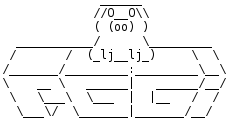

# PGGI

PHP extension providing a small langage binding for GTK+ 3 toolkit allowing to write GUI Applications.
I made this extension in order to learn how to make php extension and learn GTK, therefore this extension is highly experimental but if you want try it, I would love receiving feedbacks.
For now there isn't much but I intend to add more to it.

## Table of content

- [Getting Started](#getting-started)
    - [Prerequisites](#prerequisites)
    - [Installing](#installing)
- [Running the tests](#running-the-tests)
- [Documentation](#documentation)
- [Contact](#contact)

## Getting Started

### Prerequisites

As a prerequisite, you should have a CLI binary (command-line) version of PHP
installed along with the header files and development scripts.

PGGI needs PHP 7 or greater to run, and to build.

PGGI supports GTK+ 3.10 or greater (It should work with previous versions or GTK+ 3 but that's not for sure)

### Installing

For now you have to install it manually.

In terminal move to the pggi directory and run.

```
phpize
```
Followed by

```
./configure
```

Finally run

```
make
```

In the pggi directory there a pggi file, it's a launcher to use pggi :

```
path\pggi file
```

To test the extension, try running the exemples scripts in the exemples directory.

You can also check my other repositories where I put applications using pggi, that a good way to see how it works and have a nice demo.

## Running the tests

you can launch tests by running the file run-tests.php

For now there isn't any.

## Documentation

In the tools directory, there is a program genstub.php that generate a stub version of the extension to facilitate the use of the extension with an IDE.
Once the stub version generated, you can use it to create the documentation with apidoc or oxygen. (I made a program genapidoc.sh for apidoc)

A wiki will come to explain how to use each element of the extension.

For now there isn't a lot of information, but I'm working on it.

## Contact

if you want to contact me, you can send me an email at <valentin@famillecollet.com>


